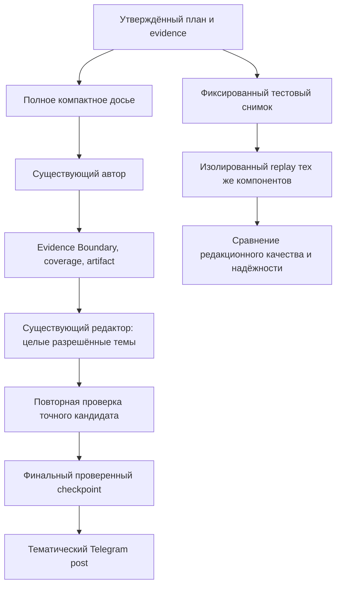

# Связный городской дайджест: редакционная спецификация

Дата: 2026-10-04. Статус: согласованный пользователем дизайн, реализация ещё не выполнена.
Основание: запрос о приятно читаемом профессиональном дайджесте; решения выбраны без дополнительных вопросов по прямому указанию пользователя.
Область: Event-First digest, его авторский материал, существующий редактор и воспроизводимая проверка качества. Исполнение лично, без субагентов.
Исходная версия кода: `c0557fc459c592ccdca2bb06846971b0bdbe686d`.

## 1. Результат для читателя

Житель за короткое чтение понимает, что происходит в городе, где ситуация различается и какая практическая информация ему пригодится. Выпуск выглядит как работа редакции: связанные сообщения образуют связную тему, детали объясняют ситуацию, атрибуция естественна, предложения не повторяют друг друга.

«Уровень Bloomberg» здесь означает пожелание к качеству, а не сертификацию или копирование конкретного издания. Ориентиры — точность и честное обозначение источников, описанные в [стандартах Reuters](https://reutersagency.com/about/standards-values/), и ясное краткое изложение, описанное в [BBC Academy: Writing Concisely](https://downloads.bbc.co.uk/academy/academyfiles/Writing_Concisely.pdf). Правила Telebrief о допустимости одиночного сообщения жителя и неизменности прямой цитаты определяет `AGENTS.md`, а не внешние редакционные руководства.

Достижимая цель — устойчиво хороший выпуск на разных типах дня. Один удачный ответ модели не подтверждает устойчивость; автоматическая проверка не доказывает литературное совершенство.

## 2. Наблюдения и гипотезы

Проверено по текущему коду:

- `_composition_writer_payload` передаёт факты вместе с материалом по отдельным composition units. Один support может повторяться в нескольких единицах.
- `_repair_digest_candidate` не вызывает редактора при отсутствии диагностических замечаний. Семантически слабый текст может пройти узкие эвристики.
- Перекомпоновка в `DigestEditor` ограничена целевыми items; текущий набор исключает items без `covered_fact_ids`. Это затрудняет объединение всей темы, включая summary-only материал.
- Исправление считается принятым, если оно безопасно и отличается от предыдущего текста. Это не доказательство улучшения стиля.
- `scripts/preview_digest.py` отключает доставку, но создаёт записи предпросмотра через production facade. Повторный `--as-of` не заменяет фиксацию всех входных данных.

Последние предпросмотры показывали фрагментацию электроснабжения, повторы сроков, формулы «данные расходятся» без достаточного объяснения и отдельный пункт о семье без указанного места. Ноль предупреждений не устранил все эти дефекты.

Гипотезы для отдельных экспериментов:

1. Однократный, ясный реестр фактов и источников поможет автору видеть тему целиком.
2. Разрешение существующему редактору переработать целый тематический блок улучшит связность.
3. Редакторская оценка даже при отсутствии regex-предупреждений обнаружит часть пропускаемых дефектов.

Эксперименты должны подтвердить эти гипотезы. Причина утреннего пропуска и влияние ingestion на задержку этим документом не считаются установленными.

## 3. Выбранный подход и альтернативы

**Рекомендуемый подход:** фиксированные данные для сравнения → компактное полное досье → редактура целой темы в существующем бюджете → оценка текста и надёжности → постепенное включение.

Дополнительные regex-запреты дешевле, но плохо распознают смысл и создают риск зажать полезные сообщения. Новый независимый AI-критик или второй автор могут улучшить отдельный выпуск, но увеличивают задержку, стоимость и число отказов. Их в этот проект не включаем.

Сначала проверяем досье, затем отдельно область редакторского вмешательства, затем их сочетание. Смена модели не входит в первый эксперимент: иначе источник улучшения станет неясным.

## 4. Неподвижные продуктовые требования

- `AGENTS.md` §0 имеет приоритет над этим документом и историческими планами.
- 100% выбранных substantive Stories и 100% RequiredDigestFacts должны сохраниться. Покрытие подтверждается содержанием grounded claims, а не только перечислением ID.
- Одиночное полезное сообщение жителя допустимо с честной атрибуцией. Число источников и официальное подтверждение не становятся новыми gates.
- Вопрос, сарказм и эмоциональная реплика не превращаются в состояние услуги или ответ.
- Сохраняются суммы, сроки, места, конкретные действия жителей и полезные ограничения знания. Поддержанные прямые цитаты неизменны.
- Синтез не создаёт причин, соседства районов, общегородского масштаба или общей хронологии без evidence. Алиасы одной улицы учитываются через существующий географический контекст.
- Тематические блоки, пустой publication lead, отсутствие dashboard. Статистика только при `include_statistics: true`.
- Один Telegram post: существующий канонический artifact должен пройти лимит 4096, включая проверку UTF-16. 2500–3700 — ориентир при достаточном материале, не обязательный минимум.
- Число видимых items не является квотой. 12–16 topic bundles — планировочный ориентир для насыщенного дня, а не обязательное число абзацев.
- `digest_allow_deterministic_fallback: false`. Никакой склейки фрагментов или наполнителя.
- Одна авторская стадия и не более двух вызовов существующего редактора; общий срок генерации сохраняется. Никаких отдельных production planner/critic вызовов.
- Литературный балл, счётчик цитат или один стилевой дефект не становятся самостоятельным publication veto. Evidence Boundary и проверки действительно вводящего в заблуждение или нечитаемого текста остаются жёсткими.
- Структурно ошибочная редакторская правка откатывается целиком. Поздняя небезопасная правка не уничтожает предыдущий точный проверенный checkpoint. Таймаут/отмена следуют действующему контракту, а не маскируются публикацией.
- Article pipeline, eligibility, знания и production Selection не меняются в этой работе.

## 5. Редакционный стандарт

### 5.1 Иерархия и синтез

Начало каждой темы сообщает главное, следующие предложения уточняют места, сроки и практические последствия. Связанные Stories становятся одним или несколькими естественными абзацами. Размер темы следует материалу, а не числу Stories.

Небольшое выбранное сообщение без географии можно встроить в общий абзац с явной оговоркой об неизвестном месте. Нельзя приписать его району соседнего предложения. Если связь с общей темой не поддержана, допустимо отдельное короткое предложение; запрета на все отдельные пункты нет.

При различиях внутри одной местности нужен локальный контраст. При разных временах нужна поддержанная последовательность. Если ни места, ни времена не объясняют различия, текст честно сохраняет неопределённость; редактор не придумывает объяснение.

### 5.2 Естественный язык

Заголовок или scan-label необязателен. Если он есть, тело добавляет детали. Когда новой детали нет, достаточно одной законченной фразы. Формулы «в сообщении говорится о», «обсуждали в чате» заменяются содержанием сообщения и подходящей атрибуцией, когда такая замена безопасна.

Атрибуция распространяется только на явно связанные с ней утверждения. Один источник не превращается в «жителей» во множественном числе. Смешение официальных сведений и сообщений жителей сохраняет различие источников.

### 5.3 Практическая польза

Для новости об услуге используются доступные сведения: что меняется, для кого, где и когда, как получить доступ. Это вопросы к источнику, а не обязательные заполненные поля. Отсутствующий месяц, тип учреждения, инструкция или график не дописываются. Полезная неполная информация остаётся допустимой; неизвестность обозначается кратко.

Отбор рекламы и бытового шума остаётся до утверждения плана. Автор или редактор не удаляет выбранный факт, потому что он кажется слабее соседних.

## 6. Архитектура

### 6.1 Полное компактное досье

Новый writer-facing формат содержит таблицы `facts`, `supports`, `units`, `blocks`, `relations` и quote allowlist. Fact ID представлен ровно одной записью; support ID — одной записью с сохранением всех различных разрешённых текстов. Units ссылаются на ID. Материал для summary-only units сохраняется отдельно от required facts.

Каждая запись сохраняет владельцев, support IDs, исходное/каноническое место, имеющиеся времена и эпистемический статус. Сохраняются доступный reply-parent контекст и ограничения знания. Отношения — навигация из существующего плана; они не разрешают новую причинность.

Удалять можно повторное представление одной и той же записи и гарантированно пустые поля. Разные формулировки источников не сливаются по похожести. Полный evidence/provenance и alias-index валидатора сохраняются внутри системы. Не обрезать строки и не удалять facts ради бюджета; непоместившийся контекст получает явную ошибку до вызова провайдера.

Автор получает короткий редакционный brief: главный смысл темы → связная география/время → конкретные детали → честная атрибуция. Claim metadata не становится шаблоном читательских предложений.

### 6.2 Существующий редактор

В рекомендуемом production режиме редактор вызывается при фактических или редакционных замечаниях и получает весь готовый дайджест с правом менять полные разрешённые тематические блоки. Обязательная редактура без замечаний сохранена только как offline эксперимент `--review-clean-text`: сравнение показало рост стоимости в 2,806 раза, что нарушает ограничение +20%. Нулевые warnings не подтверждают литературное качество; незамеченные слабости проверяются офлайн, а не дополнительным обязательным AI-вызовом.

Разрешение включает immutable base fingerprint, block/item IDs, полную принадлежность fact-bearing и summary-only units, допустимые supports и неизменённые соседние блоки. Replacement сохраняет каждую обязательную единицу в разрешённой теме ровно один раз. Summary-only coverage проверяется отдельно от fact IDs. Изменение чужого блока, неизвестный ID, потеря членства или несогласованный результат откатывают всю структурную операцию.

Содержимое replacement заново проверяется против разрешённых supports существующими проверками. Не переносить старые claims в новую прозу без проверки. Полнота ID не заменяет доказательство утверждений. Ограничения текущего semantic validator явно сохраняются в `not_evaluated`.

Второй вызов разрешён только для оставшихся замечаний либо отклонённого первого результата и получает свежий fingerprint и scope. Нет обязательного второго вызова ради разнообразия. Если весь требуемый контекст не помещается, редактору не показывается усечённая «полная» тема; шаг пропускается с диагностикой и финальным действующим safety gate.

### 6.3 Разделение безопасности и готовности

Safety результат — действующие factual/coverage/render проверки. Editorial readiness — описательная оценка связности, повторов, пользы и оставшихся ограничений. Readiness не отменяет safety и сама не блокирует выпуск.

Итоги editor attempt различают: `accepted_change`, `unchanged_safe`, `rejected_unsafe`, `invalid_response`, `skipped_context_budget`. «Безопасный изменённый текст» не маркируется как доказанно более качественный. Регулярное улучшение подтверждается сравнением готовых текстов.

## 7. Воспроизводимая проверка

### 7.1 Фиксированные данные

Шесть сценариев: насыщенная коммунальная ситуация; тихий день; противоречивые локальные сообщения и алиасы; транспорт/тарифы/практические команды; неполные анонсы и административные сведения; одиночные сообщения с бытовыми микродеталями и неуказанным местом.

Четыре сценария используются для разработки, два закрепляются как holdout до настройки prompts. Каждый снимок содержит точный план, evidence, summaries, цитаты, reply context, окно, редакционные настройки, geographical context и semantic versions. Нельзя восстанавливать часть входов из изменившейся live базы во время replay.

Публичные synthetic fixtures лежат в tests. Реальные снимки и явно запрошенные текстовые результаты лежат в игнорируемом `data/previews/digest-evaluation/`. В Git попадает только безопасный manifest и описание критериев. Автоматического сохранения source prose, prompts и промежуточных drafts нет.

Replay не подключается к БД, не запускает ingestion/selection, не создаёт publication/run/jobs/delivery. Он использует общий generation/assessment code с in-memory observer. Сеть нужна только для явно выбранных model-backed сравнений. Unit tests используют fake provider.

### 7.2 Баллы качества

Пять параметров, каждый от 0 до 4: иерархия/синтез, связность языка, отсутствие смысловых повторов, практическая ясность, сохранение деталей и естественная атрибуция. Итог — сумма × 5, максимум 100. Значения: 0 — неприемлемо; 1 — крупные дефекты; 2 — заметно мешает чтению; 3 — добротный текст с локальными недостатками; 4 — редакционно чистый текст.

Это внутренняя редакционная шкала, не объективный международный стандарт. При применимости только части вопросов практическая ясность оценивается по фактам выпуска, без штрафа за отсутствие инструкций в источниках. Оценка — письменный разбор готового текста исполнителем с конкретными примерами, без нового production AI-критика. Не использовать exact-text golden как единственный критерий.

### 7.3 Порядок экспериментов и критерии

Начальная проверка: baseline и изменённое досье, четыре development-сценария, два повтора — 16 генераций, максимум 48 writer/editor provider calls. Если улучшение отсутствует, доработать гипотезу; не переходить к автоматическому деплою.

Финальное сравнение: исходная и окончательная версии, все шесть сценариев, три повтора — 36 генераций, максимум 108 provider calls. Это отдельный ограниченный эксперимент; не бесконечное повторение до удачного текста. Для каждой версии фиксируются модель, параметры, фактические вызовы, duration, tokens/cost если доступны, failures и исходный hash. Одинаковые inputs не гарантируют одинаковый ответ модели.

Acceptance новой версии:

- Все принятые outputs проходят существующие safety проверки, 100% selected Story coverage, 100% material fact coverage и Telegram budget.
- За полный цикл нет новых нарушений сохранения одиночных сообщений, цитат, географии и практических деталей в fixtures.
- Медианный редакционный балл не ниже 85/100; минимум отдельного принятого текста не ниже 75/100; медиана выше baseline минимум на 5 баллов. Если baseline уже ≥85, допустимо отсутствие роста при устранении всех документированных крупных дефектов без регрессий.
- Новый вариант не имеет большего числа rejected/failed generations на одинаковом наборе. Оценивать качество только успешных ответов без учёта отказов запрещено.
- Каждый holdout-сценарий имеет медиану не хуже baseline и не ниже 80/100. Все выбранные supported microdetails из контрольного перечня сохранены.
- Фактическое число редакторских вызовов ≤2, действующий deadline соблюдён. P95 generation duration и измеренная стоимость сравнения растут не более чем на 20% относительно baseline; при отсутствии cost data это ограничение помечается непроверенным, а не выполненным.

Эти числа — критерии решения о rollout, не gates отдельных production выпусков. Малый набор не доказывает статистическую надёжность; он выявляет регрессии и требует последующего наблюдения.

## 8. Включение и обратимость

Два независимых предлагаемых config flags: `digest_writer_material_format = legacy|compact_v1` и `digest_editor_scope = targeted_items|thematic_blocks`. При реализации оба default сохраняют старый режим до принятия результатов; неизвестные значения отклоняются при загрузке config. Flags не включают deterministic fallback.

Порядок: изолированный replay → code checks → серверный dry-run с отключённой доставкой → включение по одной настройке → просмотр первых трёх расписанных выпусков и проверки delivery/error/deadline. Три выпуска — наблюдение, не гарантия стабильности.

При регрессии flags возвращаются к предыдущему проверенному AI-пути без изменения eligibility и знаний. Новый режим не включается, если качество выросло ценой более частых утренних отказов.

## 9. Границы этой задачи и документы

Текущая задача создаёт спецификацию и план, не меняет product code, не запускает платные сравнительные генерации и не публикует дайджест. Реализация плана выполняется последовательно без субагентов при следующем запросе на исполнение.

Этот дизайн уточняет редактуру и оценку из `2026-09-28-digest-editorial-composition-quality-design.md`; при расхождении действует `AGENTS.md` §0. План: `../plans/2026-10-04-readable-city-digest.md`.

### Решение по результатам эксперимента 04.10.2026

Режимы реализованы за независимыми настройками; production defaults сохранены. Обязательная редактура отклонена по измеренной стоимости. В diagnostics-driven сравнении стоимость снизилась на 9,96%, но два holdout сценария ухудшились; автоматическая безопасность и coverage не означают достижения редакционного стандарта. Активация нового режима отложена до успешного нового сравнения.
